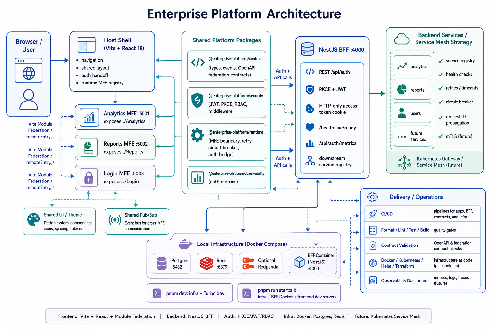

# Enterprise Platform

An enterprise-grade microfrontend platform built as a pnpm + Turbo monorepo. The
frontend is a set of Vite + React 18 applications wired together with Module
Federation, backed by a NestJS Backend-for-Frontend (BFF) and Docker-managed
Postgres and Redis.

This README summarizes the documentation in [`docs/`](docs/). For the
authoritative, continuously reviewed guides, start with
[`docs/README.md`](docs/README.md).

## Architecture Diagram



## Overview

The platform is composed of:

- **Vite React microfrontends** — a host shell plus analytics, reports, and login remotes
- **Vite Module Federation** via `@module-federation/vite` for runtime-loaded remotes
- **A NestJS BFF** on port `4000` providing REST auth (PKCE + JWT), health, and metrics
- **Docker-backed local infrastructure** for Postgres (`5432`) and Redis (`6379`)
- **Shared workspace packages** for contracts, UI, auth, pub/sub, security, runtime, and observability

The frontend was migrated from Next.js + Webpack to Vite + React Router for faster
builds, smaller bundles, and instant HMR. Some historical docs still reference the
old Next.js/Webpack setup or GraphQL-first BFF examples; prefer the current-state
guides linked below.

## Applications and Ports

| Component     | Federation name | Local URL             | Exposes              |
| ------------- | --------------- | --------------------- | -------------------- |
| Host shell    | `host`          | http://localhost:3002 | none (loads remotes) |
| Analytics MFE | `analytics`     | http://localhost:5001 | `./Analytics`        |
| Reports MFE   | `reports`       | http://localhost:5002 | `./Reports`          |
| Login MFE     | `login`         | http://localhost:5003 | `./Login`            |
| NestJS BFF    | —               | http://localhost:4000 | REST API             |
| Postgres      | —               | `localhost:5432`      | —                    |
| Redis         | —               | `localhost:6379`      | —                    |

The host shell owns navigation, shared layout, auth handoff, and dynamic remote
loading. Each remote owns its own Vite build and exposes a single federated entry
module, resolved through the host's runtime MFE registry (overridable with
`VITE_ANALYTICS_URL`, `VITE_REPORTS_URL`, and `VITE_LOGIN_URL`).

## Repository Layout

```text
enterprise-platform/
|-- apps/
|   |-- host-shell/       # Vite React shell application
|   |-- analytics-mfe/    # Analytics remote
|   |-- reports-mfe/      # Reports remote
|   `-- login-mfe/        # Login/auth remote
|-- packages/
|   |-- platform-auth/    # Auth session and BFF client helpers
|   |-- shared-pubsub/    # Event bus and pub/sub helpers
|   |-- shared-types/     # Shared TypeScript types
|   `-- shared-ui/        # MUI-based shared components and theme
|-- services/
|   `-- bff/              # NestJS backend for frontend
|-- contracts/            # API, event, and federation contracts (+ OpenAPI)
|-- security/             # JWT, PKCE, RBAC, middleware, validation utilities
|-- runtime/              # MFE boundary, retry, circuit breaker, auth bridge
|-- observability/        # Auth metrics (logging/tracing scaffolding)
|-- infra/                # Docker Compose, Kubernetes, Helm, Terraform assets
|-- tools/                # Generators, validators, and tooling
|-- scripts/              # Automation and bootstrap scripts
|-- tests/                # End-to-end and contract test suites
`-- docs/                 # Platform documentation
```

## Quick Start

Prerequisites: Node.js 20.x, pnpm, Docker Desktop (with Compose), and Git.

```bash
pnpm install
pnpm dev
```

The root `dev` script starts Postgres and Redis through
`infra/docker/docker-compose.yml`, waits for infra health, then runs all workspace
`dev` tasks via Turbo.

### Common Commands

```bash
pnpm install          # Install all workspace dependencies
pnpm dev              # Start infra + all dev-capable workspaces
pnpm build            # Build all workspaces
pnpm test             # Run all configured tests
pnpm lint             # Run all configured lint tasks

pnpm run infra:up     # Start only Postgres and Redis
pnpm run health       # Check Postgres and Redis health
pnpm run dev:down     # Stop local infra
pnpm run stack:up     # Optional: infra + BFF in Docker
```

### Focused Development

```bash
pnpm --filter host-shell dev
pnpm --filter analytics-mfe dev
pnpm --filter reports-mfe dev
pnpm --filter login-mfe dev
pnpm --filter bff dev      # run `pnpm run infra:up` first
```

## Authentication and the BFF

The NestJS BFF (`services/bff`, NestJS 10.x) exposes a REST authentication surface
built around PKCE and JWT. GraphQL packages are present but the implemented auth
surface is REST.

Key endpoints:

| Method | Endpoint                                   | Purpose                                |
| ------ | ------------------------------------------ | -------------------------------------- |
| `GET`  | `/health`, `/health/live`, `/health/ready` | Health, liveness, readiness            |
| `POST` | `/api/auth/initiate`                       | Start a PKCE session                   |
| `POST` | `/api/auth/exchange`                       | Exchange PKCE verifier for tokens      |
| `POST` | `/api/auth/refresh`                        | Rotate refresh token, issue new tokens |
| `POST` | `/api/auth/logout`                         | Revoke refresh token                   |
| `GET`  | `/api/auth/me`                             | Return the authenticated user          |
| `GET`  | `/api/auth/metrics`                        | In-memory auth metrics snapshot        |

PKCE flow at a glance: the frontend initiates a session (validated against
`DEMO_ALLOWED_EMAILS`), receives a session and code challenge, then exchanges the
verifier for signed access/refresh JWTs. The BFF stores the refresh token in cache
and sets an HTTP-only access-token cookie. The login MFE implements the browser
side of this flow, and auth state is shared across MFEs via the runtime auth bridge
and pub/sub helpers. The `docs/auth/` directory documents the detailed,
step-by-step authentication and authorization (RBAC) design.

For a lightweight demo without Postgres or Redis, set `SKIP_DATABASE=true` and
`USE_MEMORY_CACHE=true`.

## Platform Packages

- **`@enterprise-platform/contracts`** — shared TypeScript types, domain event
  contracts, Module Federation contracts, and OpenAPI YAML for the BFF and analytics
- **`@enterprise-platform/security`** — JWT utilities, PKCE helpers, RBAC roles and
  permissions, Express-compatible middleware (audit, auth, CORS, CSP, HTTPS, rate
  limiting), and validation helpers
- **`@enterprise-platform/runtime`** — MFE boundary, retry, circuit breaker, and auth
  postMessage bridge utilities
- **`@enterprise-platform/observability`** — in-memory auth metrics recorded during
  PKCE and login flows (Winston/OpenTelemetry/Prometheus are future expansion, not
  yet wired in)
- **`@enterprise-platform/shared-ui`** — MUI-based shared components and theme
- **`@enterprise-platform/shared-types`** — shared TypeScript types
- **`@enterprise-platform/shared-pubsub`** — auth and event bus helpers
- **`@enterprise-platform/platform-auth`** — auth session and BFF client helpers

## Documentation Map

| Area                        | Document                                                                                                   |
| --------------------------- | ---------------------------------------------------------------------------------------------------------- |
| Local setup                 | [docs/onboarding/setup.md](docs/onboarding/setup.md)                                                       |
| Module Federation           | [docs/frontend/MODULE_FEDERATION_IMPLEMENTATION.md](docs/frontend/MODULE_FEDERATION_IMPLEMENTATION.md)     |
| Vite migration              | [docs/frontend/MIGRATION_TO_VITE_REACT.md](docs/frontend/MIGRATION_TO_VITE_REACT.md)                       |
| State management            | [docs/frontend/STATE_MANAGEMENT.md](docs/frontend/STATE_MANAGEMENT.md)                                     |
| BFF reference               | [docs/backend/NESTJS_BFF_QUICK_REFERENCE.md](docs/backend/NESTJS_BFF_QUICK_REFERENCE.md)                   |
| BFF infra (Postgres/Redis)  | [docs/backend/BFF_POSTGRESQL_REDIS_INFRASTRUCTURE.md](docs/backend/BFF_POSTGRESQL_REDIS_INFRASTRUCTURE.md) |
| Service mesh strategy       | [docs/backend/svc-mash/design-documentation.md](docs/backend/svc-mash/design-documentation.md)             |
| Auth & authorization design | [docs/auth/](docs/auth/)                                                                                   |
| API contracts               | [docs/contracts/API_CONTRACTS_LAYER.md](docs/contracts/API_CONTRACTS_LAYER.md)                             |
| Security                    | [docs/security/SECURITY_SETUP.md](docs/security/SECURITY_SETUP.md)                                         |
| Observability               | [docs/observability/OBSERVABILITY_SETUP.md](docs/observability/OBSERVABILITY_SETUP.md)                     |
| Environment configuration   | [docs/configuration/ENVIRONMENT_CONFIGURATION.md](docs/configuration/ENVIRONMENT_CONFIGURATION.md)         |
| Infrastructure              | [docs/infrastructure/INFRASTRUCTURE_SETUP_SUMMARY.md](docs/infrastructure/INFRASTRUCTURE_SETUP_SUMMARY.md) |
| CI/CD                       | [docs/delivery/CICD_PIPELINES.md](docs/delivery/CICD_PIPELINES.md)                                         |
| Roadmap                     | [docs/planning/IMPLEMENTATION_ROADMAP.md](docs/planning/IMPLEMENTATION_ROADMAP.md)                         |

## Current State and Roadmap

The platform has moved beyond the initial implementation phase. Done: workspace
structure, Vite migration for active apps, active Module Federation, the login MFE,
the NestJS BFF with the PKCE/JWT REST flow, the contracts/security/runtime packages,
and local Docker infra for Postgres and Redis. Observability is currently limited to
auth metrics.

Near-term priorities (see the [roadmap](docs/planning/IMPLEMENTATION_ROADMAP.md))
include adding a real CI workflow, cleaning up leftover Next.js migration artifacts,
aligning Docker Compose with Vite ports, hardening environment configuration,
expanding observability deliberately, and enforcing contracts in CI.
