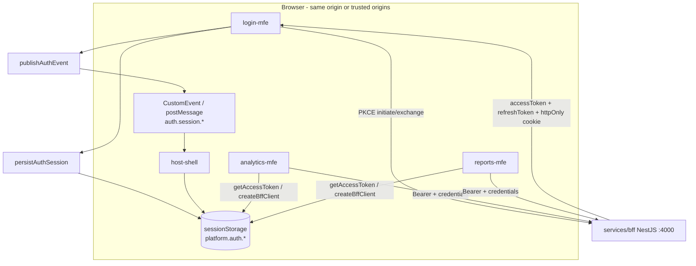

# Authentication Token Sharing Across Microfrontends

Design guide for how sign-in tokens issued by the BFF are stored, shared, and consumed by the host shell and every Module Federation remote (analytics-mfe, reports-mfe, login-mfe, and future MFEs).

## Related documents

- [Login MFE + PKCE implementation](./login-mfe-pkce-implementation.md) — PKCE flow and BFF auth API
- BFF entry point: `services/bff/src/main.ts` (NestJS, port **4000**)
- Shared client: `@enterprise-platform/platform-auth`

---

## 1. Architecture overview



### Principles

| Principle                          | Implementation                                             |
| ---------------------------------- | ---------------------------------------------------------- |
| Tokens minted only on BFF          | PKCE exchange at `POST /api/auth/exchange`                 |
| No secrets in remotes              | Only public client IDs; no JWT signing in MFEs             |
| Single session store key namespace | `platform.auth.*` in `sessionStorage`                      |
| Host orchestrates, remotes consume | Auth events + shared `platform-auth` package               |
| Fail closed                        | Missing/invalid token → 401 from BFF, redirect to `/login` |

---

## 2. What the BFF returns after login

Successful `POST /api/auth/exchange` response:

```json
{
  "accessToken": "<JWT>",
  "refreshToken": "<JWT>",
  "user": {
    "id": "...",
    "email": "test@example.com",
    "name": "test",
    "picture": null,
    "roles": ["user"]
  }
}
```

Additionally the BFF sets an **httpOnly** cookie (default name `accessToken`) when `credentials: 'include'` is used on the exchange request.

| Artifact             | Lifetime             | Stored by                                   | Used for                                      |
| -------------------- | -------------------- | ------------------------------------------- | --------------------------------------------- |
| `accessToken` (JWT)  | ~1h (configurable)   | `sessionStorage` + optional httpOnly cookie | `Authorization: Bearer` on API calls          |
| `refreshToken` (JWT) | ~7d                  | `sessionStorage` only                       | `POST /api/auth/refresh`                      |
| `user`               | Until logout         | `sessionStorage`                            | UI display, RBAC hints                        |
| httpOnly cookie      | Same as access token | Browser cookie jar                          | BFF routes that read cookie instead of header |

---

## 3. Shared package: `@enterprise-platform/platform-auth`

Location: `packages/platform-auth`

### 3.1 Session storage keys

| Key                          | Constant                         | Content         |
| ---------------------------- | -------------------------------- | --------------- |
| `platform.auth.user`         | `AUTH_STORAGE_KEYS.user`         | JSON `AuthUser` |
| `platform.auth.accessToken`  | `AUTH_STORAGE_KEYS.accessToken`  | JWT string      |
| `platform.auth.refreshToken` | `AUTH_STORAGE_KEYS.refreshToken` | JWT string      |

### 3.2 Core APIs

```typescript
import {
  persistAuthSession,
  getAuthSession,
  getAccessToken,
  getAuthUser,
  clearAuthSession,
  isAuthenticated,
  createBffClient,
} from '@enterprise-platform/platform-auth';
```

| Function                           | When to call                                           |
| ---------------------------------- | ------------------------------------------------------ |
| `persistAuthSession(authResponse)` | Immediately after successful PKCE exchange (login-mfe) |
| `getAccessToken()`                 | Before each BFF or protected API request               |
| `getAuthUser()`                    | Render user menu, audit metadata                       |
| `clearAuthSession()`               | Logout (after `POST /api/auth/logout`)                 |
| `createBffClient({ bffBaseUrl })`  | Typed fetch wrapper with Bearer + credentials          |

---

## 4. Step-by-step: End-to-end token flow

### Step 1 — User signs in (login-mfe)

1. User submits email on login remote.
2. `login-mfe` calls `POST {BFF}/api/auth/initiate` with `{ email, provider: 'local' }`.
3. Client stores `sessionId`, `state`, `codeVerifier` in **session** PKCE keys (separate from auth tokens).
4. `login-mfe` calls `POST {BFF}/api/auth/exchange` with PKCE fields.
5. On success:
   - `persistAuthSession(result)` writes `platform.auth.*` to `sessionStorage`.
   - `publishAuthEvent({ type: 'auth.session.created', ... })` notifies the host.

**Code reference:** `apps/login-mfe/src/hooks/usePkceLogin.ts`

### Step 2 — Host shell receives auth event

1. `LoginContainer` subscribes via `subscribeAuthEvent` from `@enterprise-platform/shared-pubsub`.
2. On `auth.session.created`, host dispatches `host.auth.success` for in-shell routing.
3. Session data is already in `sessionStorage` (same origin as host when shell and remotes share top-level origin, or propagated via storage events — see Step 5).

**Code reference:** `apps/host-shell/src/components/mfe-container-components/LoginContainer.tsx`

### Step 3 — Protect host routes

1. On host bootstrap, call `isAuthenticated()` from `platform-auth`.
2. If false and route is not `/login`, redirect to `/login`.
3. Optional: subscribe to `auth.logout` event to clear state and redirect.

Example (host `main.tsx` or router guard):

```typescript
import { isAuthenticated } from '@enterprise-platform/platform-auth';

function requireAuth() {
  if (!isAuthenticated()) {
    window.location.href = '/login';
    return false;
  }
  return true;
}
```

### Step 4 — Wire analytics-mfe (or any remote)

Add dependency in `apps/analytics-mfe/package.json`:

```json
"@enterprise-platform/platform-auth": "workspace:*"
```

#### 4a. Read user for display

```typescript
import { getAuthUser } from '@enterprise-platform/platform-auth';

const user = getAuthUser();
if (!user) {
  // show "please sign in" or rely on host to not load remote
}
```

#### 4b. Call BFF with token

```typescript
import { createBffClient } from '@enterprise-platform/platform-auth';

const bff = createBffClient({
  bffBaseUrl: import.meta.env.VITE_BFF_URL ?? 'http://localhost:4000',
  credentials: 'include',
});

const dashboards = await bff.fetch('/api/v1/analytics/dashboards');
```

`createBffClient` automatically:

- Sets `Authorization: Bearer <accessToken>` when a token exists in `sessionStorage`.
- Sends `credentials: 'include'` so the httpOnly cookie is included on same-site requests.

#### 4c. Validate session with BFF

```typescript
const me = await bff.getCurrentUser(); // GET /api/auth/me
```

If this returns 401, call `bff.refreshTokens()` once, then retry. If refresh fails, `clearAuthSession()` and emit logout.

### Step 5 — Cross-MFE communication (Module Federation)

Remotes run in the same browser tab as the host. Use **two channels**:

| Channel                              | Use case                                                              | Package                            |
| ------------------------------------ | --------------------------------------------------------------------- | ---------------------------------- |
| `sessionStorage` (`platform.auth.*`) | Shared token read by all MFEs on **same registrable domain**          | `platform-auth`                    |
| `auth.session.*` events              | Notify host/remotes of login, failure, logout without polling storage | `shared-pubsub`                    |
| `postMessage` (origin allowlist)     | iframe / federated boundary when origins differ                       | `shared-pubsub` + `runtime` bridge |

**Same origin (typical local dev):**

- Host: `http://localhost:3000`
- Login remote: `http://localhost:5003` (different port = different origin)

When host and remotes are **different origins**, `sessionStorage` is **not** shared. Mitigations:

1. **Recommended for production:** Serve all MFEs behind one origin (e.g. `https://app.example.com/login`, `/analytics`) via reverse proxy.
2. **Dev:** After login, host reads `auth.session.created` event payload and calls `persistAuthSession` on the host origin (extend host handler to persist tokens from event if BFF returns tokens in event data — currently user only; tokens are persisted in login-mfe origin).

For cross-origin dev, add to host `LoginContainer` on `auth.session.created`:

```typescript
// When event includes tokens (extend contract if needed), or proxy login through host origin
import { persistAuthSession } from '@enterprise-platform/platform-auth';

// If login and host share storage (same origin deployment), no extra step needed.
// If not, host should run login UI on same origin or use BFF cookie on shared parent domain.
```

**Production pattern:** Deploy login remote behind host path `/login` so `sessionStorage` is shared.

### Step 6 — Token refresh

Before access token expiry (or on 401):

```typescript
const bff = createBffClient({ bffBaseUrl: 'http://localhost:4000' });

try {
  await bff.refreshTokens();
} catch {
  await bff.logout();
  window.location.href = '/login';
}
```

BFF endpoint: `POST /api/auth/refresh` with body `{ "refreshToken": "..." }`.

### Step 7 — Logout

```typescript
const bff = createBffClient({ bffBaseUrl });
await bff.logout(); // revokes refresh server-side + clearAuthSession()

import { publishAuthEvent, AuthEventTypes } from '@enterprise-platform/shared-pubsub';

publishAuthEvent({
  type: AuthEventTypes.LOGOUT,
  version: 1,
  correlationId: crypto.randomUUID(),
  timestamp: new Date().toISOString(),
  data: {},
  metadata: { source: 'host-shell' },
});
```

All MFEs should subscribe to `auth.logout` and clear local UI state.

---

## 5. Checklist per new microfrontend

- [ ] Add `@enterprise-platform/platform-auth` dependency.
- [ ] Read `VITE_BFF_URL` from env (align with host `.env.example`).
- [ ] Use `createBffClient` for all BFF HTTP calls.
- [ ] Do not store tokens in `localStorage` (XSS surface); use `platform-auth` session helpers only.
- [ ] On 401, attempt one refresh; then redirect to login.
- [ ] Subscribe to `auth.logout` via `shared-pubsub` if the MFE holds user-specific state.
- [ ] Never send `refreshToken` to non-BFF services.

---

## 6. BFF endpoints consumed by MFEs

| Method | Path                 | Auth                      | Purpose                     |
| ------ | -------------------- | ------------------------- | --------------------------- |
| POST   | `/api/auth/initiate` | None                      | Start PKCE                  |
| POST   | `/api/auth/exchange` | None                      | Get tokens                  |
| POST   | `/api/auth/refresh`  | None (body: refreshToken) | Rotate access token         |
| POST   | `/api/auth/logout`   | None (body: refreshToken) | Revoke session              |
| GET    | `/api/auth/me`       | Bearer or cookie          | Validate session / get user |
| GET    | `/api/auth/metrics`  | None                      | Ops metrics (dev)           |

OpenAPI: `contracts/src/openapi/v1/auth.yaml`

---

## 7. Security considerations

1. **httpOnly cookie** — Protects access token from XSS reading the cookie; still send Bearer from memory/session for cross-origin API calls when needed.
2. **CORS** — BFF `CORS_ORIGIN` must list every MFE origin with `credentials: true`.
3. **postMessage** — Use `VITE_ALLOWED_MESSAGE_ORIGINS`; never use `'*'` in production.
4. **PKCE** — Required for public clients; implemented in BFF + login-mfe.
5. **Short-lived access JWT** — Default 1h; refresh with stored refresh token only against BFF.

---

## 8. Local development quick reference

```powershell
# BFF (NestJS unified entry)
cd services/bff
$env:USE_MEMORY_CACHE="true"
$env:SKIP_DATABASE="true"
$env:DEMO_ALLOWED_EMAILS="test@example.com"
pnpm run start:dev

# login-mfe :5003, host-shell :3000
# Sign in as test@example.com
# In browser DevTools → Application → Session Storage → platform.auth.*
```

Verify token sharing:

1. Sign in on `/login`.
2. Open DevTools → Application → Session Storage → keys `platform.auth.*`.
3. Navigate to analytics route; in console:  
   `JSON.parse(sessionStorage.getItem('platform.auth.user'))`
4. Call BFF:  
   `fetch('http://localhost:4000/api/auth/me', { headers: { Authorization: 'Bearer ' + sessionStorage.getItem('platform.auth.accessToken') } })`

---

## 9. Unified BFF entry (no dual stack)

| Environment | Command                         | Entry file               |
| ----------- | ------------------------------- | ------------------------ |
| Local dev   | `pnpm run start:dev`            | `src/main.ts`            |
| Production  | `pnpm run start:prod`           | `dist/main.js`           |
| Docker      | `Dockerfile` / `Dockerfile.dev` | Nest build               |
| Tests       | `pnpm test`                     | `tests/api.nest.test.ts` |

Legacy Express files live in `services/bff/legacy/` and are not started by any script.
