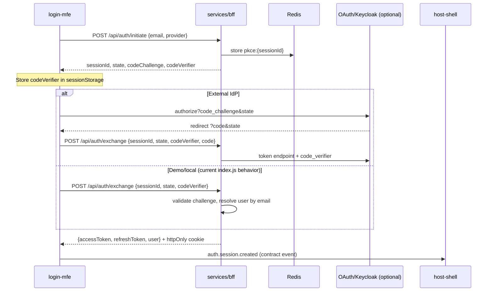

# Login MFE + PKCE BFF — Implementation Guide

This document is the step-by-step guide for implementing PKCE-based authentication across the login microfrontend, BFF, contracts, security, runtime, observability, and shared packages.

## Current state

| Area             | Status                                                                                                     |
| ---------------- | ---------------------------------------------------------------------------------------------------------- |
| `apps/login-mfe` | Exists; `Login.tsx` is a **demo** (local state + `postMessage`, no BFF/PKCE)                               |
| `services/bff`   | **Unified NestJS** entry (`src/main.ts`, port **4000**). Legacy Express archived in `services/bff/legacy/` |
| `contracts`      | `login-mfe.ts` federation only; **no** auth events or OpenAPI                                              |
| `security`       | JWT helpers in `security/src/auth/jwt.ts`                                                                  |
| `runtime`        | `MFEBoundary` only                                                                                         |
| `observability`  | OTEL / Winston / Prometheus configs, not wired to auth                                                     |
| `packages`       | `shared-pubsub` is analytics-only; setup.md mentions `platform-auth` but it **does not exist**             |

PKCE is implemented in NestJS (`services/bff/src/auth/`). Legacy Express reference code is archived under `services/bff/legacy/`.

## Goals

1. Login MFE (`apps/login-mfe`) drives **PKCE** via the BFF (secrets and token issuance stay server-side).
2. **Contracts** define REST shapes, errors, federation props, and cross-app auth events.
3. **BFF** owns PKCE sessions, user lookup/validation, JWT/cookies, and structured error responses.
4. **security**, **runtime**, **observability**, and **packages** are integrated consistently.
5. Host shell loads login remote and reacts to auth events.

## Architecture



### BFF stack decision

Pick one approach and document the choice in your PR:

- **Option A (recommended):** Port PKCE from `pkce.js` / `sessionStore.js` / `index.js` into **NestJS** modules; deprecate `index.js` as entry; align Docker `PORT` consistently (3000 or 4000).
- **Option B (faster):** Keep Express `index.js` for auth; NestJS for analytics/users only; login-mfe calls `http://localhost:4000`.

The phases below assume **Option A** (single Nest BFF, Redis-backed PKCE).

---

## Phase 0 — Prerequisites

- [x] Redis running (`pnpm run infra:up` starts Redis on `6379` via `infra/docker/docker-compose.yml`).
- [x] Environment variables documented (`services/bff/.env.example`, `apps/login-mfe/.env.example`).
- [ ] `pnpm install` at monorepo root.
- [ ] Optional deep dive: `docs/NESTJS_BFF_PKCE_GRAPHQL.md`.

**Option A completed:** NestJS BFF (`nest start` / `src/main.ts`) on port **4000**; legacy Express moved to `services/bff/legacy/`. See [auth token sharing](./auth-token-sharing-across-mfes.md).

---

## Phase 1 — Contracts (`contracts/`)

### 1.1 Auth types

Create `contracts/src/types/auth.ts`:

- `User`, `AuthTokens`, `PkceInitiateRequest`, `PkceInitiateResponse`, `PkceExchangeRequest`, `AuthErrorCode` enum.

Align error shape with OpenAPI `ApiError` in `contracts/src/openapi/schemas/errors.yaml` (`code`, `message`, `timestamp`, optional `field`).

### 1.2 Auth events

Create `contracts/src/events/auth-events.ts` (mirror `analytics-events.ts`):

| Event type             | Purpose                   |
| ---------------------- | ------------------------- |
| `auth.session.created` | Successful login          |
| `auth.session.failed`  | Login failure with reason |
| `auth.session.expired` | PKCE session expired      |
| `auth.logout`          | User signed out           |

Export from `contracts/src/events/index.ts`.

### 1.3 OpenAPI

Create `contracts/src/openapi/v1/auth.yaml`:

| Method | Path                 | Purpose                      |
| ------ | -------------------- | ---------------------------- |
| POST   | `/api/auth/initiate` | Start PKCE                   |
| POST   | `/api/auth/exchange` | Complete PKCE                |
| POST   | `/api/auth/refresh`  | Refresh tokens               |
| POST   | `/api/auth/logout`   | Revoke refresh               |
| GET    | `/api/auth/me`       | Current user (Bearer/cookie) |

Reuse `errors.yaml` responses. Run `pnpm validate` in `contracts/`.

### 1.4 Federation contract

Extend `contracts/src/federation/login-mfe.ts`:

```typescript
export interface LoginRemoteProps {
  bffBaseUrl: string;
  onAuthSuccess?: (event: AuthSessionCreatedEvent) => void;
  onAuthFailure?: (event: AuthSessionFailedEvent) => void;
}

export interface LoginRemote {
  Login: ComponentType<LoginRemoteProps>;
}
```

### 1.5 Build

- [ ] Ensure workspace apps depend on the contracts package.
- [ ] Rebuild contracts after changes.

---

## Phase 2 — Shared packages (`packages/`)

### 2.1 Auth pub/sub

Extend `packages/shared-pubsub` (or add `packages/platform-auth`):

- `publishAuthEvent` / `subscribeAuthEvent`
- `window.postMessage` + `CustomEvent` with **typed** contract payloads
- **Origin allowlist** from env (do not use `'*'` in production)

### 2.2 Shared types

Add auth-related exports to `packages/shared-types/src/index.ts` (re-export from contracts or thin client types).

### 2.3 Optional `packages/platform-auth`

Keep it thin:

- `createPkceClient(bffBaseUrl)`
- `storeVerifier`, `clearSession`
- No JWT signing in the browser

---

## Phase 3 — Security (`security/`)

### 3.1 PKCE utilities

Create `security/src/auth/pkce.ts` — port logic from `services/bff/src/pkce.js`:

- `generateCodeVerifier()`, `generateCodeChallenge()`, `validateCodeChallenge()`

### 3.2 JWT alignment

Use `security/src/auth/jwt.ts` in BFF instead of duplicating `token.js`:

- Map BFF payload `{ sub, email, roles }` → `AuthContext` in `jwt.config.ts`.

### 3.3 Validation schemas

Create `security/src/validation/auth.ts` (Zod):

| Field                                | Rules                           |
| ------------------------------------ | ------------------------------- |
| `email`                              | valid email, required           |
| `provider`                           | enum e.g. `keycloak` \| `local` |
| `sessionId`, `state`, `codeVerifier` | non-empty strings on exchange   |

### 3.4 User validation & error codes

| Code                   | HTTP | User-facing message (example)                    |
| ---------------------- | ---- | ------------------------------------------------ |
| `INVALID_INPUT`        | 400  | Please check email and provider.                 |
| `INVALID_EMAIL`        | 400  | Enter a valid email address.                     |
| `USER_NOT_FOUND`       | 401  | No account found for this email.                 |
| `USER_DISABLED`        | 403  | This account has been disabled.                  |
| `INVALID_CREDENTIALS`  | 401  | Email or password is incorrect.                  |
| `INVALID_PKCE_SESSION` | 400  | Your sign-in session expired. Please try again.  |
| `STATE_MISMATCH`       | 400  | Sign-in could not be verified. Please try again. |
| `INVALID_TOKEN`        | 401  | Session expired. Please sign in again.           |
| `RATE_LIMITED`         | 429  | Too many attempts. Try again later.              |

Wire existing middleware where applicable:

- `rateLimiter.ts` on `/api/auth/*`
- `sanitize.ts` on email input
- `auth.middleware.ts` for `/api/auth/me` and protected routes

Export new symbols from `security/src/index.ts`.

---

## Phase 4 — BFF (`services/bff/src`)

### 4.1 Module layout (NestJS)

```
services/bff/src/auth/
  auth.module.ts
  auth.controller.ts      # REST /api/auth/*
  auth.service.ts
  auth.resolver.ts        # optional GraphQL parity with schema.js
  dto/
    initiate-pkce.dto.ts
    exchange-code.dto.ts
  pkce.service.ts
  user-validation.service.ts
```

Register in `app.module.ts` (replace empty `module.auth.module.ts` shell).

### 4.2 Port legacy behavior

| Concern          | Nest implementation                                        |
| ---------------- | ---------------------------------------------------------- |
| PKCE session TTL | Redis via `CacheModule` key `pkce:{sessionId}`, TTL 600s   |
| One-time session | Delete on exchange (`consumePkceSession`)                  |
| Cookies          | `accessToken` httpOnly, `sameSite: lax`, `secure` in prod  |
| Rate limit       | `@nestjs/throttler` or `express-rate-limit` on auth routes |

### 4.3 User validation service

1. Validate email format (class-validator DTO + security Zod).
2. Resolve user:
   - **Phase 1:** allowlist via `DEMO_ALLOWED_EMAILS` or in-memory map (matches current `buildUser(email)`).
   - **Phase 2:** call `usersService` from `config.configuration.ts`.
3. Throw `HttpException` with contract error code in body:

```json
{
  "code": "USER_NOT_FOUND",
  "message": "No account found for this email.",
  "timestamp": "2026-05-24T12:00:00.000Z",
  "requestId": "..."
}
```

Extend `HttpExceptionFilter` to pass through `code` from custom `AuthException`.

### 4.4 OAuth (optional)

`config.configuration.ts` already defines `oauth.*`. After PKCE validation, if `provider !== 'local'`, POST to `oauth.tokenUrl` with `code`, `code_verifier`, `client_id`, `redirect_uri`. Until IdP is ready, support `provider: 'local'` for email-only demo flow.

### 4.5 GraphQL (optional)

Port mutations from `schema.js` to `auth.resolver.ts` for parity with `tests/api.test.js`.

### 4.6 Deprecation

- [ ] Mark `index.js` as legacy; point Docker `CMD` to `nest start` or proxy auth only.
- [ ] Update `tests/api.test.js` to hit Nest app during migration.

### 4.7 Dependencies

Add workspace deps in `services/bff/package.json`:

- `@enterprise-platform/security`
- contracts package (types)
- observability (logging/tracing bootstrap)

---

## Phase 5 — Observability (`observability/`)

### 5.1 BFF bootstrap

In `services/bff/src/main.ts` (before `NestFactory.create`):

```typescript
import '@enterprise-platform/observability/tracing/opentelemetry.config';
```

### 5.2 Auth metrics (Prometheus)

- `auth_pkce_initiate_total`
- `auth_pkce_exchange_total{status="success|failure"}`
- `auth_login_failures_total{reason="USER_NOT_FOUND|..."}`

### 5.3 Structured logging

In `auth.service.ts` and `interceptor.logging.interceptor.ts`:

- Log `requestId`, `email` (hashed in prod), `provider`, outcome.
- **Never** log `codeVerifier` or tokens.

### 5.4 Frontend (login-mfe)

- Dev-only console for failures.
- Optional: `auth.session.failed` with `correlationId` from `X-Request-ID`.

---

## Phase 6 — Runtime (`runtime/`)

### 6.1 MFE boundary

Update `runtime/src/isolation/mfe-boundary.ts` — use `onError` for observability reporting.

Add `runtime/src/auth/post-message-bridge.ts`:

- `createAuthSafePostMessage(allowedOrigins)` for host ↔ login communication.

### 6.2 Host integration

In `apps/host-shell/src/components/mfe-container-components/LoginContainer.tsx`:

- Wrap remote with `MFEBoundary`.
- Pass `bffBaseUrl` from `VITE_BFF_URL`.
- `subscribeAuthEvent` → update session / redirect to `/analytics`.

### 6.3 Retry

Use `runtime/src/retry/retry-policy.ts` in login-mfe API client for transient 5xx only (not 401/400).

---

## Phase 7 — Login MFE (`apps/login-mfe/src`)

### 7.1 Structure

```
apps/login-mfe/src/
  api/authClient.ts
  hooks/usePkceLogin.ts
  components/Login.tsx
  components/AuthError.tsx
  vite/App.tsx
```

### 7.2 Login flow

1. User submits email (and password when credential check exists).
2. `authClient.initiate({ email, provider })` → store `codeVerifier`, `sessionId`, `state` in `sessionStorage`.
3. **Local provider:** call `exchange` immediately.
4. **Keycloak:** redirect with `code_challenge`, `state`; on callback, `exchange` with `code`.
5. On success: `publishAuthEvent({ type: 'auth.session.created', ... })`.
6. On failure: map `response.body.code` to user-facing messages.

### 7.3 Client-side validation

- Email format before BFF call.
- Disable submit while loading.
- Display server `message` for `USER_NOT_FOUND`, etc.

### 7.4 Env (`apps/login-mfe/.env.example`)

```env
VITE_BFF_URL=http://localhost:4000
VITE_OAUTH_PROVIDER=local
VITE_OAUTH_CLIENT_ID=
```

---

## Phase 8 — Configuration & Docker

### 8.1 BFF env

```env
PORT=4000
CORS_ORIGIN=http://localhost:3000,http://localhost:5003
JWT_SECRET=...
JWT_REFRESH_SECRET=...
REDIS_HOST=localhost
OAUTH_CLIENT_ID=
OAUTH_TOKEN_URL=
DEMO_ALLOWED_EMAILS=test@example.com,admin@example.com
```

### 8.2 Ports

- Docker: `pnpm run stack:up` maps BFF `4000:4000` via `infra/docker/docker-compose.bff.yml`.
- Login MFE: Vite port `5003` (`apps/login-mfe/vite.config.ts`).
- Host: `mfeRegistry.login` → `VITE_LOGIN_URL` default `http://localhost:5003`.

### 8.3 CORS

Include host shell + login-mfe origins with `credentials: true`.

---

## Phase 9 — Testing checklist

| Layer     | Test                                           |
| --------- | ---------------------------------------------- |
| BFF       | Port `tests/api.test.js` to Nest supertest     |
| BFF       | Invalid email → `INVALID_EMAIL`                |
| BFF       | Unknown user → `USER_NOT_FOUND`                |
| BFF       | Wrong verifier → `INVALID_PKCE_SESSION`        |
| BFF       | Expired PKCE session                           |
| login-mfe | Component test: server error display           |
| E2E       | Host loads remote → login → event → navigation |

---

## Phase 10 — Implementation order

1. Save and follow this document.
2. **Contracts** — types, events, OpenAPI, federation props.
3. **security** — PKCE + auth validation + error codes.
4. **BFF** — Nest auth module + Redis + validation messages.
5. **observability** — tracing + auth metrics/logs.
6. **packages** — auth pub/sub client.
7. **login-mfe** — replace demo `Login.tsx`.
8. **runtime + host-shell** — boundary + event subscription.
9. **Docker/env** — port and CORS alignment.
10. **Tests** — migrate `api.test.js`; add validation cases.
11. **Deprecate** `index.js` when Nest parity is verified.

---

## Folder mapping

| Folder            | Action                                                      |
| ----------------- | ----------------------------------------------------------- |
| `contracts`       | Auth types, events, OpenAPI, federation props               |
| `services/bff`    | Nest `AuthController` / `AuthService`; unify with `pkce.js` |
| `security`        | PKCE + Zod + JWT reuse + rate limit on auth                 |
| `runtime`         | `MFEBoundary` on login; safe postMessage bridge             |
| `observability`   | OTEL in BFF `main.ts`; auth metrics                         |
| `packages`        | Auth pub/sub; optional `platform-auth` client               |
| `apps/login-mfe`  | Real PKCE UI + BFF integration                              |
| `apps/host-shell` | `bffBaseUrl`, subscribe to auth events                      |

---

## Known gaps

1. ~~**Dual BFF entrypoints**~~ — Resolved: Nest only; see `services/bff/README.md`.
2. **No user directory yet** — validation is email-based demo; plan `usersService` integration.
3. **Cross-origin sessionStorage** — login-mfe (:5003) and host (:3000) use different origins in dev; use same-origin proxy in production (documented in [auth-token-sharing-across-mfes.md](./auth-token-sharing-across-mfes.md)).
4. **GraphQL** — Legacy GraphQL in `legacy/schema.js`; not yet ported to Nest.

---

## References

- Token sharing design: [auth-token-sharing-across-mfes.md](./auth-token-sharing-across-mfes.md)
- Legacy Express (archived): `services/bff/legacy/`
- Platform auth client: `packages/platform-auth`
- Federation contract: `contracts/src/federation/login-mfe.ts`
- Nest BFF bootstrap: `services/bff/src/main.ts`
- Extended patterns: `docs/NESTJS_BFF_PKCE_GRAPHQL.md`

## How to run locally

```
cd "d:\Dev\microfrontend-analytics-dashboard\microfrontend streaming\enterprise-platform"
pnpm install
# BFF (memory cache, no Redis required)
cd services\bff
$env:USE_MEMORY_CACHE="true"
$env:DEMO_ALLOWED_EMAILS="test@example.com,admin@example.com"
pnpm run start:dev
# Login MFE (another terminal)
cd apps\login-mfe
pnpm run dev
# Host shell (another terminal)
cd apps\host-shell
pnpm run dev
```

Sign in with `test@example.com` or `admin@example.com`.

Note: Full `AppModule` still expects Postgres (TypeORM). Auth tests use an isolated module. For auth-only dev, set USE_MEMORY_CACHE=true and ensure DB is up, or we can add `SKIP_DATABASE` in a follow-up.

Tests: `pnpm exec jest --config jest.config.js tests/auth-nest.test.ts in services/bff`.
